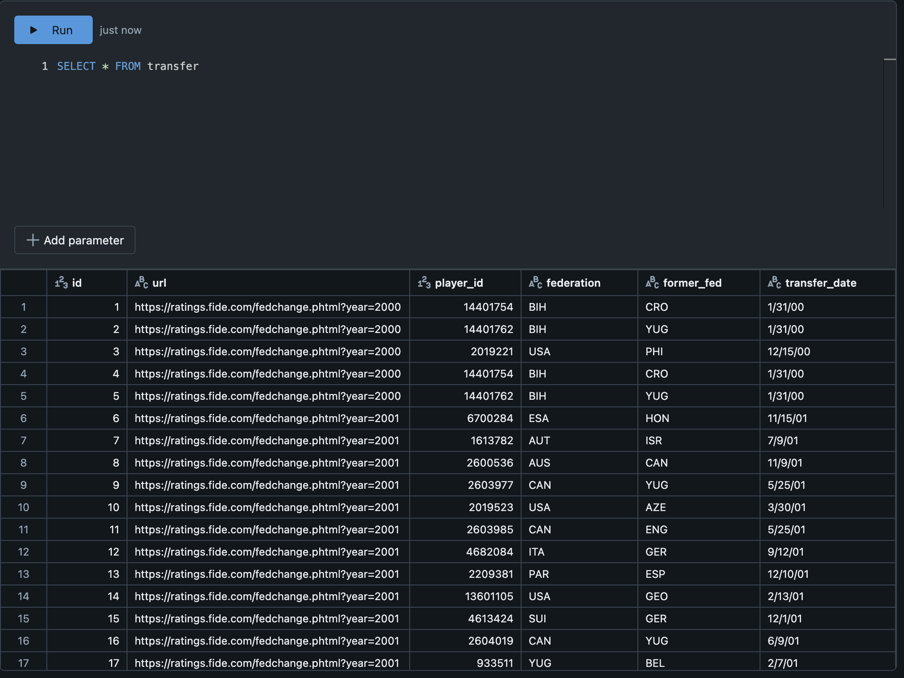
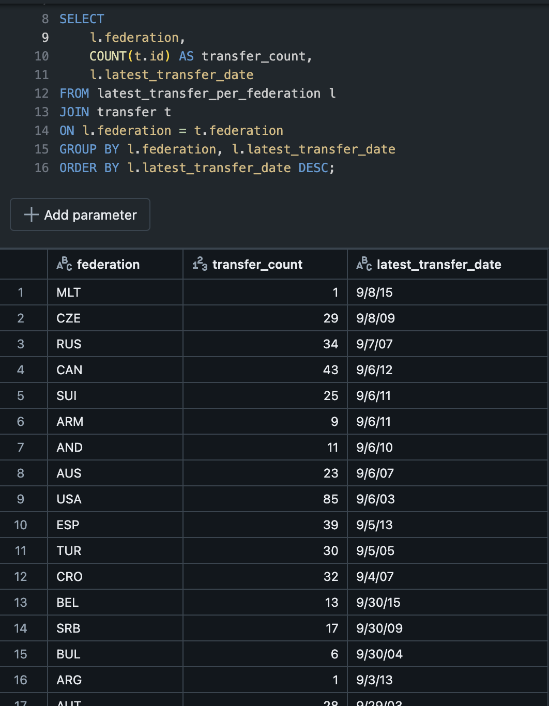

[](https://github.com/nogibjj/skye-assignment-6/actions/workflows/cicd.yml)
# Skye Assignment 5 - SQL Database Operations
This repository contains a Python package named chess_transfer that provides functionality for managing chess player transfer data between federations. The package allows users to perform CRUD (Create, Read, Update, Delete) operations on a SQL database, retrieve the latest transfer dates, and count the total number of transfers for each federation.

# Package Details
The chess_transfer package is set up using setuptools and includes dependencies such as databricks-sql-connector, pandas, and python-dotenv for connecting to the database and performing data operations. The package structure allows for easy installation and integration into projects involving chess player transfer data.
### Setup
To package and install the chess_transfer package, follow these steps:
1. Create a source distribution:
```bash
venv/bin/python3 setup.py sdist
```

2. Install the package:
```bash
venv/bin/pip3 install ./dist/chess_transfer-1.0.0.tar.gz
```
These commands will create a source distribution and install it into the virtual environment.

### Running the Package
The package includes a command-line interface for executing different data processing steps. You can perform the following operations:

1. Extract data:
```bash
venv/bin/python3 main.py extract
```
2. Transform data:
```bash
venv/bin/python3 main.py transform
```

3. Load data:
```bash
venv/bin/python3 main.py load
```

4. Query data:
```bash
venv/bin/python3 main.py query```

These commands run the respective data processing steps, allowing for modular execution of the data pipeline.

# SQL Query Explanation
The SQL query provided demonstrates the use of joins, aggregation, and sorting. It operates on a single table, `transfer`, which contains information about player transfers between federations. Below is a breakdown of the query and its purpose.

## Query Breakdown
### WITH Clause: ``latest_transfer_per_federation``
```sql
WITH latest_transfer_per_federation AS (
    SELECT 
        federation, 
        MAX(transfer_date) AS latest_transfer_date
    FROM transfer
    GROUP BY federation
)
```
The `WITH` clause defines a Common Table Expression (CTE) named `latest_transfer_per_federation`, which calculates the most recent transfer date for each federation by:
- Selecting the `federation` column from the transfer table.
- Using `MAX(transfer_date)` to find the most recent date of transfer for each federation.
- Grouping the results by `federation` to ensure we get the latest date for each unique federation.
The result is a temporary table (`latest_transfer_per_federation`) with two columns:
- `federation`: The federation name.
- `latest_transfer_date`: The most recent date of transfer for the federation.

### Main Query: ``Joining the CTE with the transfer Table``
```sql
SELECT 
    l.federation,
    COUNT(t.id) AS transfer_count,
    l.latest_transfer_date
FROM latest_transfer_per_federation l
JOIN transfer t
ON l.federation = t.federation
GROUP BY l.federation, l.latest_transfer_date
ORDER BY l.latest_transfer_date DESC;
```
1. Main Query Selection:
- We select the `federation` from the CTE (`latest_transfer_per_federation`) using the alias `l`.
- We count the total number of transfers for each federation using `COUNT(t.id)` to get the total number of transfers (`transfer_count`).
- We also include `l.latest_transfer_date` to show the most recent transfer date.
2. JOIN Operation:
- The CTE is joined with the original `transfer` table on the `federation` column to count all the transfers associated with each federation.
3. Group By:
- The results are grouped by federation and latest_transfer_date to ensure the correct aggregation is applied.
4. Ordering:
- The results are ordered by latest_transfer_date in descending order, showing the federations with the most recent transfers at the top.

## Initial Data

## Query Result


### Final Output
The query produces the following columns in the result set:
- `federation`: The name of the federation.
- `transfer_count`: The total number of transfers for that federation.
- `latest_transfer_date`: The most recent date when a transfer occurred for that federation.

## Logging Details [link](https://github.com/nogibjj/skye-assignment-5/blob/main/log/database_log.log).
- **Log Location**: All logs are saved in the `log` folder. 
- **Log Level**: Database operations are logged at the _debug level_ for detailed traceability.
- **Log Format**: Includes timestamps, log levels, and messages.

## CI/CD Pipeline
A CI/CD pipeline is configured using GitHub Actions to automatically test each database operation. The pipeline loads the `.db` file and runs the operations to ensure they work as expected.
